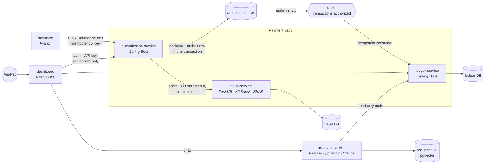

# CardFlow

**A card-payments platform built as microservices:** charges are authorized exactly once, scored by an explainable fraud model, posted to a double-entry ledger through Kafka, and borderline cases go to a human review queue. An AI assistant answers cardholder questions with cited, guarded answers.

Java 25 · Spring Boot 4 · PostgreSQL 18 · Kafka · Python 3.14 · FastAPI · XGBoost + SHAP · pgvector · Claude · Next.js 16 · Docker · GitHub Actions


> **All data is synthetic.** No real card numbers, people or financial products. "CardFlow Card" benefits are fictional.

## Quick start

Needs Docker Desktop (or Docker Engine with Compose v2) and `make`.

```bash
git clone https://github.com/jasonlam11/cardflow.git && cd cardflow
make demo
```

`make demo` creates `.env` from [`.env.example`](.env.example), builds and starts all 7 services, fills them with ~60 cards of realistic synthetic traffic (fraud patterns included), and prints the URL. The first build takes several minutes; after that it starts in about a minute.

Then open **http://127.0.0.1:3000**:
- **Review queue:** charges the fraud model flagged, with the score and the top reasons. Approve or reject with a note.
- **Transactions / Overview:** live traffic, decline reasons, cards (always masked to the last 4 digits).
- **Assistant:** ask "How much did I spend last month?" or "Is a 7-hour flight delay covered?". Without an API key it runs in a clearly labelled demo mode; set `ANTHROPIC_API_KEY` in `.env` to use Claude.

`make help` lists everything else (tests, load tests, evals, retraining). `make down` stops the stack; data is kept.

## Results

| Area | Result | Source |
|---|---|---|
| **Throughput / latency** | 200 req/s sustained for 2 min: **p50 4.4 ms, p95 28.9 ms, 0 errors**, every charge fraud-scored and posted to the ledger (one laptop, all services sharing 8 CPUs) | [performance](docs/performance.md) |
| **Exactly-once** | 0 duplicate ledger postings across every load test and retry test; Kafka stopped mid-traffic: **0 lost** | [performance](docs/performance.md), [e2e](tests/e2e/) |
| **Event pipeline** | Approval → ledger posting p95 **509 ms** at 200 req/s (was 57 s at peak load before 3 bottleneck fixes) | [performance](docs/performance.md#bottlenecks-found-and-fixed) |
| **Fraud model** | PR-AUC **0.918** on held-out days; flags **89.8%** of fraud; auto-declines at **87.1%** precision; live replay through the stack within 3 points | [model card](docs/model-card.md) |
| **Resilience** | fraud-service stopped under load: p95 6.4 ms, 0 errors (circuit breaker + rules fallback) | [ADR 0007](docs/adr/0007-circuit-breaker-fallback.md) |
| **Human review** | Approve → ledger posted in ~0.5–1.4 s; two analysts deciding at once → exactly one wins | [ADR 0010](docs/adr/0010-human-review-audit-trail.md) |
| **Assistant** | Retrieval recall@4 **100%** on a 36-question eval; every answer cited or replaced by "I don't know"; 0 injection leaks (demo mode; real-model eval on demand) | [eval results](docs/eval-results.md) |
| **Tests** | **231** across unit, integration (Testcontainers), browser (Playwright) and end-to-end suites, all in CI | [Testing](#testing) |

## Architecture



Every service owns its database and talks to the others only through HTTP APIs and Kafka events. Only the dashboard faces users.

### How one charge flows
1. **authorization-service** gets `POST /authorizations` with an `Idempotency-Key`. A retry with the same key gets the stored result back, never a second charge.
2. It asks **fraud-service** for a score. That service computes features from the card's history, runs XGBoost, and returns a band plus SHAP reason codes. If it's slow or down, a circuit breaker switches to conservative rules.
3. In **one database transaction**, it locks the card row, applies the rules (status, currency, available credit, fraud band), saves the decision and, if approved, writes an event to the **outbox** table.
4. HIGH risk is declined. REVIEW goes to `PENDING_REVIEW`, where credit is held and **a human decides** in the dashboard. LOW proceeds normally.
5. The outbox relay publishes to **Kafka**. **ledger-service** consumes each event once (deduplicated by event ID) and posts a balanced **double-entry** transaction.

## Design decisions

The reasoning behind each choice is recorded as an ADR ([index](docs/adr/README.md)). The ones that matter most:

| Decision | Why | ADR |
|---|---|---|
| Transactional outbox | The decision and its event commit together, so Kafka outages lose nothing | [0005](docs/adr/0005-transactional-outbox.md) |
| Idempotency keys + idempotent consumer | Client retries and Kafka redelivery can't double-charge | [0006](docs/adr/0006-idempotency.md) |
| Double-entry ledger, DB-enforced | Balances derived, never stored; Postgres rejects unbalanced or edited history | [0003](docs/adr/0003-double-entry-ledger.md) |
| Circuit breaker + rules fallback | A sick fraud-service can't take payments down | [0007](docs/adr/0007-circuit-breaker-fallback.md) |
| One feature implementation for training and serving | No training/serving skew | [0008](docs/adr/0008-shared-feature-code.md) |
| Human review with an append-only audit trail | The model never has the final word on borderline cases | [0010](docs/adr/0010-human-review-audit-trail.md) |
| RAG + guardrails in code | Citations and amounts are verified, not trusted; tools are read-only | [0011](docs/adr/0011-rag-design.md), [0012](docs/adr/0012-llm-interface-and-guardrails.md) |
| Prometheus metrics + JSON logs with correlation IDs | Measure the pipeline, not just the API | [0013](docs/adr/0013-observability.md) |

[docs/NOTES.md](docs/NOTES.md) explains how everything works in plain language, with every gotcha we hit along the way.

## Testing

| Suite | What it proves | Run | Tests |
|---|---|---|---|
| ledger-service | Double-entry rules (incl. raw-SQL DB constraint tests), consumer dedupe, DLT | `make test-ledger` | 51 |
| authorization-service | Idempotency, row locking under concurrency, outbox under Kafka outage, circuit breaker, review conflicts | `make test-auth` | 59 |
| fraud-service | Feature math, API, Postgres history, **model quality gate** (retrains from scratch) | `make test-fraud` | 28 |
| assistant-service | Guardrails against a scripted misbehaving model, tool scope, retrieval, pgvector | `make test-assistant` | 38 |
| simulator | Dataset realism and determinism | `make test-sim` | 16 |
| dashboard | Components, BFF input handling (Vitest); review + chat flows in a real browser (Playwright) | `npm test`, `npm run test:e2e` | 26 + 9 |
| end-to-end | Exactly-once under retries, Kafka outage, fraud-service outage | `make e2e` | 4 |

CI runs every suite on each pull request, plus a free assistant eval, dependency audits, and weekly container image scans.

## Repository map

```
services/
  authorization-service/   Java: authorizations, cards, review, outbox
  ledger-service/          Java: double-entry ledger, Kafka consumer
  fraud-service/           Python: features, XGBoost model, training pipeline
  assistant-service/       Python: RAG, tools, guardrails, eval suite
dashboard/                 Next.js ops UI (BFF route handlers in src/app/api)
simulator/                 synthetic traffic, labeled datasets, replay
perf/                      k6 load tests + pipeline report
tests/e2e/                 end-to-end tests against the compose stack
infra/                     Postgres init, Terraform (Phase 7)
docs/                      ADRs, NOTES, model card, eval results, performance
```

## More documentation
- [docs/NOTES.md](docs/NOTES.md): how it all works, decision log, glossary, troubleshooting
- [docs/performance.md](docs/performance.md): load-test method, results, bottlenecks fixed
- [docs/model-card.md](docs/model-card.md): fraud model data, metrics, limitations
- [docs/eval-results.md](docs/eval-results.md): assistant eval
- [PLAN.md](PLAN.md) and [PROGRESS.md](PROGRESS.md): the roadmap and status. **Phases 0–6 are done; Phase 7 (AWS with Terraform) is next.**

<details><summary>Service ports (local)</summary>

| Component | Address | Notes |
|---|---|---|
| dashboard | [127.0.0.1:3000](http://127.0.0.1:3000) | The only user-facing service |
| ledger-service | 127.0.0.1:8081 | [/swagger-ui.html](http://127.0.0.1:8081/swagger-ui.html), /actuator/prometheus |
| authorization-service | 127.0.0.1:8082 | [/swagger-ui.html](http://127.0.0.1:8082/swagger-ui.html), /actuator/prometheus |
| fraud-service | 127.0.0.1:8083 | [/docs](http://127.0.0.1:8083/docs), /model, /metrics |
| assistant-service | 127.0.0.1:8084 | /info, /metrics |
| PostgreSQL 18 + pgvector | 127.0.0.1:5432 | One database and login per service |
| Kafka 4.3 (KRaft) | 127.0.0.1:9092 | Containers use `kafka:29092` |

All ports bind to `127.0.0.1` only. If `localhost:3000` shows a different app, another local server is using that port; use `127.0.0.1:3000`.
</details>

<details><summary>Screenshots</summary>


</details>
