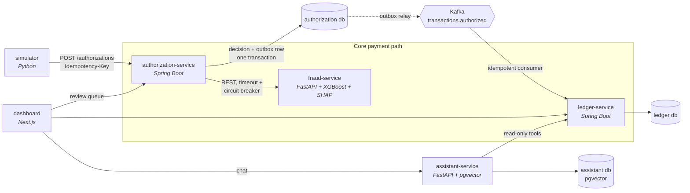

# CardFlow

A simplified card payments platform built as microservices. A synthetic merchant sends a charge, and the platform **authorizes** it, **scores it for fraud** with explainable reason codes, records it in a **double-entry ledger**, and routes borderline cases to a **human review queue**. An **AI assistant** answers spending and card-benefit questions with grounded, cited answers and guardrails.

> **Status:** Phase 3 (fraud scoring) in progress. See [PLAN.md](PLAN.md) for the roadmap, [PROGRESS.md](PROGRESS.md) for status, and [docs/NOTES.md](docs/NOTES.md) for how everything works and why.
> All data is synthetic. No real card numbers or personal data.

## Architecture



Each service owns its own database and talks to the others only through REST APIs and Kafka events.

## Run locally

Requirements: Docker Desktop (or another Docker engine with Compose v2) and `make`.

```bash
make up      # creates .env from .env.example on first run, starts the stack, and waits for health
make ps      # shows container health
make logs    # tails logs (make logs s=kafka for one service)
make build   # rebuilds service images after code changes
make simulate ARGS="--cards 20 --charges 500 --rate 20"   # synthetic traffic
make e2e     # end-to-end tests against the running stack
make train   # regenerate the dataset and retrain the fraud model (+ model card)
make down    # stops the stack (data is kept)
```

| Component | Host address | Notes |
|---|---|---|
| PostgreSQL 18 + pgvector | `localhost:5432` | One database and one login per service |
| Kafka 4.3 (KRaft) | `localhost:9092` | Containers use `kafka:29092` |
| ledger-service | `localhost:8081` | API docs at [`/swagger-ui.html`](http://localhost:8081/swagger-ui.html) |
| authorization-service | `localhost:8082` | API docs at [`/swagger-ui.html`](http://localhost:8082/swagger-ui.html) |
| fraud-service | `localhost:8083` | API docs at [`/docs`](http://localhost:8083/docs); model info at `/model` |

Ports bind to `127.0.0.1` only.

## Repository layout

```
services/           authorization, ledger, fraud, assistant
simulator/          synthetic traffic generator
dashboard/          Next.js UI
infra/postgres/     database init scripts
infra/terraform/    AWS infrastructure (Phase 7)
docs/adr/           architecture decision records
```

## Measured so far
| | |
|---|---|
| 1,000 simulated charges (25 cards, 50/s) | 926 approved, 74 declined, 44 client retries all replayed |
| Approved authorizations vs ledger postings | 926 = 926, **0 duplicates**, totals match to the cent |
| Kafka stopped mid-traffic (e2e test) | **0 transactions lost**; ledger catches up after restart |
| Outbox → Kafka publish lag | p50 284 ms, p95 531 ms |
| Fraud model, held-out days ([model card](docs/model-card.md)) | PR-AUC **0.918**; flags 89.8% of fraud; auto-declines at 87.1% precision |
| Fraud model, live replay (20,041 real authorizations) | 86.3% recall, 87.3% auto-decline precision, 0.15% of legit charges declined |
| fraud-service down (e2e test) | Authorizations continue on rules fallback; model resumes automatically |

## Design decisions

Recorded as ADRs in [`docs/adr/`](docs/adr/).
