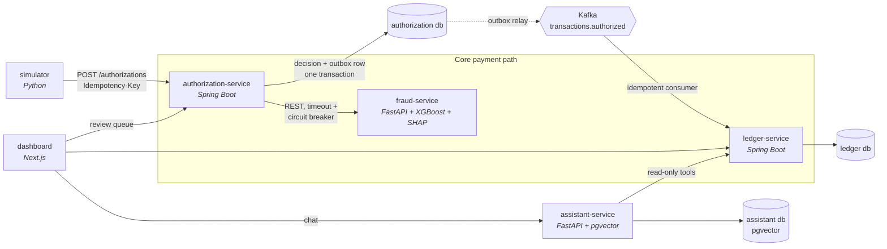

# CardFlow

A simplified card payments platform built as microservices. A synthetic merchant sends a charge, and the platform **authorizes** it, **scores it for fraud** with explainable reason codes, records it in a **double-entry ledger**, and routes borderline cases to a **human review queue**. An **AI assistant** answers spending and card-benefit questions with grounded, cited answers and guardrails.

> **Status:** Phase 0, infrastructure. See [PLAN.md](PLAN.md) for the roadmap and [PROGRESS.md](PROGRESS.md) for what's done.
> All data is synthetic. No real card numbers or personal data.

## Architecture



Each service owns its own database and talks to the others only through REST APIs and Kafka events.

## Run locally

Requirements: Docker Desktop (or another Docker engine with Compose v2) and `make`.

```bash
make up      # creates .env from .env.example on first run, starts the stack, and waits for health
make ps      # shows container health
make logs    # tails logs (make logs s=kafka for one service)
make down    # stops the stack (data is kept)
```

| Component | Host address | Notes |
|---|---|---|
| PostgreSQL 18 + pgvector | `localhost:5432` | One database and one login per service |
| Kafka 4.3 (KRaft) | `localhost:9092` | Containers use `kafka:29092` |

Ports bind to `127.0.0.1` only.

## Repository layout

```
services/           authorization, ledger, fraud, assistant
simulator/          synthetic traffic generator
dashboard/          Next.js UI
infra/postgres/     database init scripts
infra/terraform/    AWS infrastructure (Phase 7)
docs/adr/           architecture decision records
```

## Design decisions

Recorded as ADRs in [`docs/adr/`](docs/adr/).
