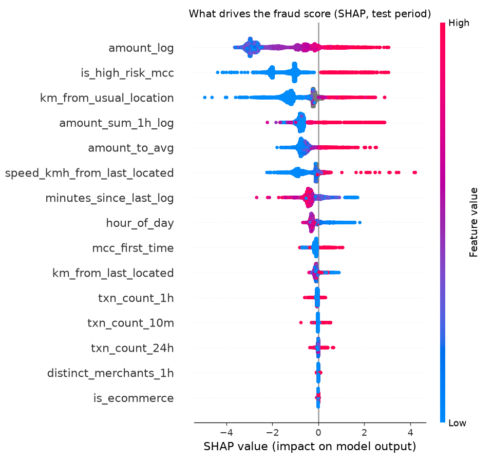

# Model card: CardFlow fraud model

> Generated by `services/fraud-service/training/train.py`; do not edit by hand. Regenerate with `make train`.

| | |
|---|---|
| Model version | `fraud-xgb-5fce97ecbf` |
| Trained | 2026-10-02T02:45:07+00:00 |
| Algorithm | XGBoost gradient-boosted trees, 101 trees, max depth 5 |
| Output | Probability-like score in [0, 1], a band (LOW / REVIEW / HIGH) and the top 3 reason codes |
| Intended use | Real-time scoring of synthetic card authorizations in the CardFlow demo |
| Not for | Real cardholders or real payment decisions |

## Data
- **Fully synthetic**, from the CardFlow simulator (`python -m cardflow_sim dataset`, seed 7): 255,003 transactions, 1.5% fraud.
- No personal data, no demographic attributes, and no proxies for them (location is only used relative to the card's own history).
- Fraud patterns injected: velocity bursts, first-time high-risk categories, impossible travel, amount spikes. Legitimate traffic includes trips, big purchases, new categories and short bursts, so the patterns overlap with normal behaviour.

## Split (by time, never random)
| Train | Validation (early stopping + thresholds) | Test (reported below) |
|---|---|---|
| days 0-62 (178,447 rows) | days 63-76 (39,908 rows) | days 77+ (36,648 rows, 469 fraud) |

A random split would leak the future into training (the same burst would appear in both sets) and inflate every metric.

## Features (15)
Computed by `fraud/features.py` from the card's own previous transactions (last 30 days, at most 100), identically in training and serving: amount and amount vs. the card's average, transaction counts in 10 min / 1 h / 24 h, spend in the last hour, time since the last transaction, distance and implied speed from the last in-person transaction, distance from the card's usual location, first time in this category, high-risk category, online vs. in person, hour of day, distinct merchants in the last hour.

## Results on the test period
Accuracy is not reported: with 1.3% fraud, always answering "legit" would score 98.7%.

| Metric | Value |
|---|---|
| **PR-AUC** (average precision) | **0.9181** (random would be 0.0128) |
| ROC-AUC | 0.9958 |

| Policy | Precision | Recall | Share of all charges |
|---|---|---|---|
| **Flag for review or decline** (score ≥ 0.8761) | 72.3% | **89.8%** | 1.6% |
| **Auto-decline** (score ≥ 0.9420) | **87.1%** | 81.9% | 1.2% |
| Rule-based fallback (flag for review) | 30.7% | 16.6% | 0.7% |

**Recall by fraud pattern** (flagged for review or declined):

| Pattern | Test cases | Model | Rules fallback |
|---|---|---|---|
| amount spike | 46 | 45.6% | 13.0% |
| impossible travel | 51 | 80.4% | 7.8% |
| unusual mcc | 38 | 86.8% | 39.5% |
| velocity burst | 334 | 97.6% | 15.9% |

**Scoring latency** (features + prediction + SHAP, one transaction, in-process): p50 0.38 ms, p95 0.45 ms.

## Thresholds
- **REVIEW** = highest threshold with validation recall >= 0.9. Charges between REVIEW and HIGH go to a human analyst; the model never makes the final call on borderline cases.
- **HIGH** = lowest threshold with validation precision >= 0.9. Only these are declined automatically.
- Chosen on validation data only, then measured once on test.

## Explainability
Each score comes with up to 3 reason codes from per-transaction SHAP values (XGBoost's built-in TreeSHAP, `pred_contribs=True`). Only features that pushed the score *up* become reasons.

## Limitations
- Synthetic data: the patterns are cleaner than real fraud, so real-world performance would be lower. The value here is the pipeline, not the numbers.
- Weakest pattern: **amount spike** (45.6% recall). A large purchase from a card with little history looks like a legitimate big purchase; more history per card, or merchant-level signals, would help.
- Cold start: a card with no history gets no velocity or location-change signal for its first charges.
- Fraudsters adapt; a real model needs monitoring for drift and regular retraining with labels from chargebacks and analyst decisions.
- Thresholds trade analyst workload against missed fraud; the review share above is the workload.

## Fallback
If fraud-service is slow or down, authorization-service uses simple rules (the "Rule-based fallback" row): it never auto-declines and only routes large or high-risk-category charges to review.
